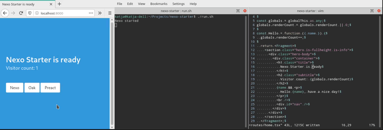

# 🎒 Nexo
Preact apps with Deno

## Quick start and example
- [Nexo Starter](https://github.com/nexojs/starter)
- `npx degit nexojs/starter`

## Features
- Hot module replace for server modules
- Live reload
- Outputs server errors in browser
- Logs client bundle errors in browser
- [Preact](https://github.com/preactjs/preact) SSR
- [Otion](https://github.com/kripod/otion) SSR
- Auto bundling and hashing of client js assets

## Philosophy
- Only require [Deno](https://github.com/denoland/deno) on the system
- Render as much as possible on the server
- But render dynamic parts only on the client
- Don't reinvent existing browser architecture
  - No client side routing
  - Neither polyfill's nor babel for stone age browsers like IE-11
- [Oak](https://github.com/oakserver/oak) for http
  - Giving freedom how to setup server middleware
  - No file system based routing
- [Preact](https://github.com/preactjs/preact) for dom rendering
- [Otion](https://github.com/kripod/otion) for css

## Future ideas
- Live reload scroll position recovery
- Minifying client bundles
- 404 Page template
- Lazy bundling of client js
